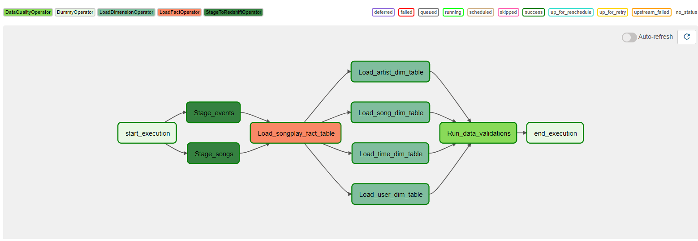

## Data pipeline with Airflow: 

The project focuses on building a Airflow automated data pipeline, that defines custom operators to perform tasks such as staging the data, filling the data warehouse and running data validation checks.

The source data is extracted from `million song dataset` that resides in S3 and needs to be processed in a Amazon Redshift cluster. The source datasets consist of JSON logs that tell about user activity in the application and JSON metadata about the songs the users listen to.

Three main components for the repository:

- `dags/ foder`: where the pipeline is defined and configured.

- `plugins/ folder`: custom airflow operators developed using the BaseOperator class for staging data to a redshift cluster, loading data to tables with the ingested data and for data validations & quality checks.

-  `A helper class` for the SQL transformations.

The graph below shows the full pipeline tasks and the dependencies:

** AWS IAM user credentials (S3 and Redshift access permissions) & AWS Redshift connection configurations in airflow are needed to run the dags properly.

